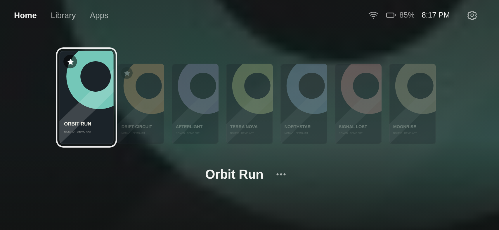
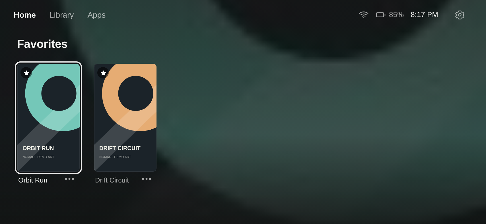

<div align="center">
  
  <h1>Nomad Launcher</h1>
  <p>A quiet home for your Android game library.</p>

[](https://github.com/itsskiwee/nomad-launcher/actions/workflows/ci.yml)
[](https://github.com/itsskiwee/nomad-launcher/releases)
[](LICENSE)
[](docs/compatibility.md)

**[Download APK](https://github.com/itsskiwee/nomad-launcher/releases/latest/download/nomad-launcher.apk)** · **[Getting started](docs/getting-started.md)** · **[Report a bug](https://github.com/itsskiwee/nomad-launcher/issues/new/choose)**
</div>

---

Nomad is a landscape launcher for Android gaming devices. Browse your games by
cover, swipe into Favorites, and launch Android games or your preferred emulator.
The interface stays focused on your library, with optional video backgrounds and
music controls.

**Early release:** developed and tested on a Redmi Note 8 Pro running Android 13.
The APK supports Android 8.0+, but other devices and emulator versions need more
community testing. Root is optional for the library and launcher;
[advanced controls](docs/compatibility.md#root-features) have a narrower hardware scope.

## A look inside

| Home | Favorites |
| --- | --- |
|  |  |

Screenshots use original demo artwork and fictional game names. Games, emulator
binaries, commercial cover art, BIOS files, and video themes are not bundled.

## Features

- **Cover-first Home.** Most-played games up front; tap to select, tap again to launch.
- **Swipeable Favorites.** Swipe up from Home for your favorites and down to return.
- **Searchable library.** Android games and ROM folders together, with explicit game menus.
- **Emulator handoff.** PPSSPP, DuckStation, NetherSX2, M64Plus FZ, and RetroArch integrations.
- **Make it yours.** Custom covers, wallpaper, local video themes, and adaptive colors.
- **Playtime.** Per-game totals and last-session time for games launched through Nomad, with optional Android usage access.
- **Battery insights.** Observed charge loss, average drain, and estimated remaining time; tap the battery indicator.
- **Keep music close.** Playback controls after granting Android notification access.
- **Optional root controls.** Supported-device performance profiles, shutdown, idle cleanup,
  and PPSSPP exit integration. Disabled by default on new installations.
- **60 FPS patches (root).** PSP games that run their logic at 30 fps get the community 60 FPS
  patch applied on launch: Nomad reads each ISO's `DISC_ID`, writes `PSP/Cheats/<DISC_ID>.ini` from
  `app/assets/fps-patches.txt`, sets `EnableCheats` (and `[CPU] CPUSpeed` for patches that need it,
  e.g. Gran Turismo) in `ppsspp.ini`, and stops a lingering PPSSPP so it boots fresh. On by default
  for supported discs; the game's ⋯ menu has a "60 FPS patch" row to turn it off per game, which
  also removes the cheat file. Verified on Crisis Core: 31 fps off, 61 fps on (PPSSPP's own counter,
  `iShowStatusFlags = 1`). Patches ship for Crisis Core, GTA: Vice City Stories, God of War: Chains
  of Olympus, Assassin's Creed: Bloodlines, Gran Turismo and Project DIVA (US/JP discs); add a block
  to the table for others.

## Install

1. Download **[nomad-launcher.apk](https://github.com/itsskiwee/nomad-launcher/releases/latest/download/nomad-launcher.apk)** on your Android device.
2. Open it and allow installation from your browser or file manager when Android asks.
3. Open **Nomad**, add a game folder, and install/configure an emulator for each platform.
4. Optionally choose Nomad as your default Home app in Android Settings.

No account or API key is required. Each release includes a SHA-256 checksum and
signing certificate information. See [installation and updates](docs/getting-started.md)
for permissions, troubleshooting, and upgrade details.

## Build and contribute

The app uses Java and a local HTML/CSS/JavaScript WebView interface. There is no Gradle
project or runtime JavaScript framework. The build uses standard Android SDK tools.

```sh
git clone https://github.com/itsskiwee/nomad-launcher.git
cd nomad-launcher
# Requires JDK 17 and Android SDK platform/build-tools 35.
./build.sh --debug
# Output: build/nomad-launcher.apk
```

See **[building](docs/building.md)** for prerequisites and signing, and
**[contributing](CONTRIBUTING.md)** for tests and pull requests.

| Project guide | Details |
| --- | --- |
| [Compatibility](docs/compatibility.md) | Android versions, emulators, root support, known limits |
| [Architecture](docs/architecture.md) | Native shell, WebView, storage, and JavaScript bridges |
| [Privacy](docs/privacy.md) | Local data, permissions, and network use |
| [Release process](docs/releasing.md) | Maintainer signing, tagging, and APK publication |
| [Changelog](CHANGELOG.md) | Changes by release |
| [Roadmap](ROADMAP.md) | Current priorities and ways to help |
| [Security](SECURITY.md) | Report vulnerabilities privately |

## License

Nomad's source code and original project assets are available under the
[MIT License](LICENSE). Third-party games, emulators, artwork, and dependencies
retain their own licenses. See [third-party notices](THIRD_PARTY_NOTICES.md).
