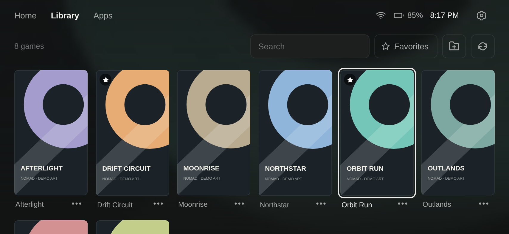
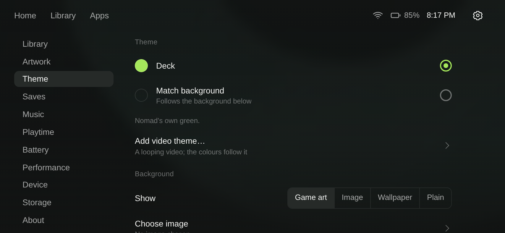

<div align="center">
  
  <h1>Nomad Launcher</h1>
  <p><strong>A quiet home for your Android game library.</strong><br>
  Free and open-source emulation frontend for Android handhelds and phones.</p>

[](https://github.com/itsskiwee/nomad-launcher/actions/workflows/ci.yml)
[](https://github.com/itsskiwee/nomad-launcher/releases)
[](LICENSE)
[](docs/compatibility.md)

<a href="https://github.com/itsskiwee/nomad-launcher/releases/latest/download/nomad-launcher.apk"></a>
&nbsp;
<a href="https://apps.obtainium.imranr.dev/redirect?r=obtainium://app/%7B%22id%22%3A%22com.rawal.pocketdeck%22%2C%22url%22%3A%22https%3A%2F%2Fgithub.com%2Fitsskiwee%2Fnomad-launcher%22%2C%22author%22%3A%22itsskiwee%22%2C%22name%22%3A%22Nomad%20Launcher%22%7D"></a>


</div>

Nomad puts your games front and centre: covers first, your most-played up front, and
one tap (or one button) to launch the right emulator. Your library works offline, with
no account, no ads and no analytics. Root is optional and only unlocks extras.

## Highlights

**Your library, tidied**
- 21 systems, from NES to Switch, alongside your installed Android games
- Search, favorites, and hidden games for anything you don't want to see
- Box art downloads automatically from libretro-thumbnails; your own art always wins
- Multi-disc sets, cue sheets and regional versions show as a single game
- Brings over covers, videos, titles and favorites from an ES-DE or Skraper library

**Made for playing**
- Picks an installed emulator per system, or choose one per system or per game
- Full controller navigation, with touch still working everywhere
- Video previews behind the selected game on Home
- Playtime per game, and battery drain and time remaining at a tap

**Across your devices**
- Save sync between a phone and a handheld through any shared folder (Syncthing, cloud drive)
- RetroAchievements progress for each game, matched by file hash
- Artwork and game info on the second screen of dual-screen handhelds

**Optional root extras**
- PSP 60 FPS patches applied at launch (Crisis Core, God of War, GTA and more)
- PS2 widescreen patches through NetherSX2's own database
- Performance profiles on validated hardware

<table>
  <tr>
    <td></td>
    <td></td>
    <td></td>
  </tr>
  <tr>
    <td align="center">Library</td>
    <td align="center">Favorites</td>
    <td align="center">Settings</td>
  </tr>
</table>

<sub>Screenshots use original demo artwork. Games, emulators, BIOS files and commercial
cover art are never bundled.</sub>

## Install

1. Download **[nomad-launcher.apk](https://github.com/itsskiwee/nomad-launcher/releases/latest/download/nomad-launcher.apk)**, or add Nomad to **[Obtainium](https://obtainium.imranr.dev/)** for automatic updates.
2. Open the APK and allow installation from your browser or file manager when Android asks.
3. Open **Nomad**, add your game folders, and install an emulator for each system.
4. Optionally set Nomad as your Home app in Android Settings.

Requires Android 8.0 or later. Each release includes a SHA-256 checksum and signing
certificate details. See [getting started](docs/getting-started.md) for permissions,
folder layout and updates, and [compatibility](docs/compatibility.md) for the full
list of systems and emulators.

## Tested devices

Nomad is an early release. It is developed on the device below; every report from
other hardware helps.

| Device | Android | Status |
| --- | --- | --- |
| Redmi Note 8 Pro | 13 | Primary development device, all features |
| Android simulated second display | 13 | Second-screen presentation |

Running Nomad on a Retroid, AYN, Anbernic or another device?
**[Send a device report](https://github.com/itsskiwee/nomad-launcher/issues/new?template=device.yml)**, even if everything works.

## Build and contribute

Nomad is Java plus a local HTML/CSS/JavaScript WebView interface, built with the
standard Android SDK tools. There is no Gradle project and no runtime framework.

```sh
git clone https://github.com/itsskiwee/nomad-launcher.git
cd nomad-launcher
# Requires JDK 17 and Android SDK platform/build-tools 35.
./build.sh --debug
# Output: build/nomad-launcher.apk (installs separately as Nomad Dev)
```

See **[building](docs/building.md)** for prerequisites and signing, and
**[contributing](CONTRIBUTING.md)** for tests and pull requests.

| Guide | Details |
| --- | --- |
| [Compatibility](docs/compatibility.md) | Systems, emulators, controllers, root features, known limits |
| [Architecture](docs/architecture.md) | Native shell, WebView, storage, and JavaScript bridges |
| [Privacy](docs/privacy.md) | Local data, permissions, and network use |
| [Changelog](CHANGELOG.md) | Changes by release |
| [Roadmap](ROADMAP.md) | Current priorities and ways to help |
| [Release process](docs/releasing.md) | Versioning, beta builds, signing and publication |
| [Security](SECURITY.md) | Report vulnerabilities privately |

## License

Nomad's source code and original project assets are available under the
[MIT License](LICENSE). Third-party games, emulators, artwork, and dependencies
retain their own licenses. See [third-party notices](THIRD_PARTY_NOTICES.md).
